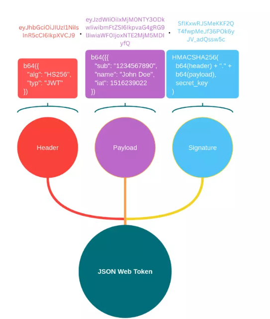
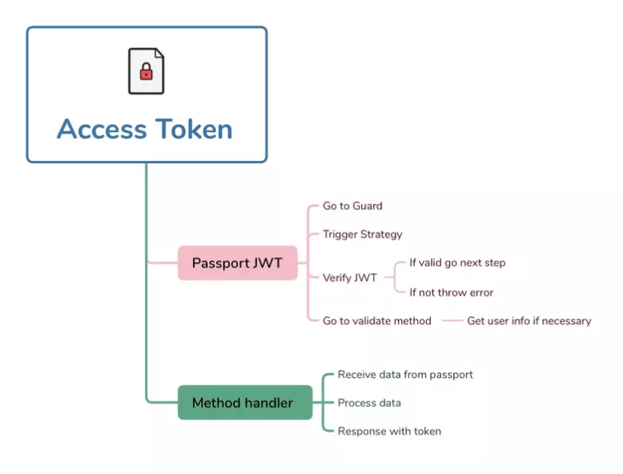
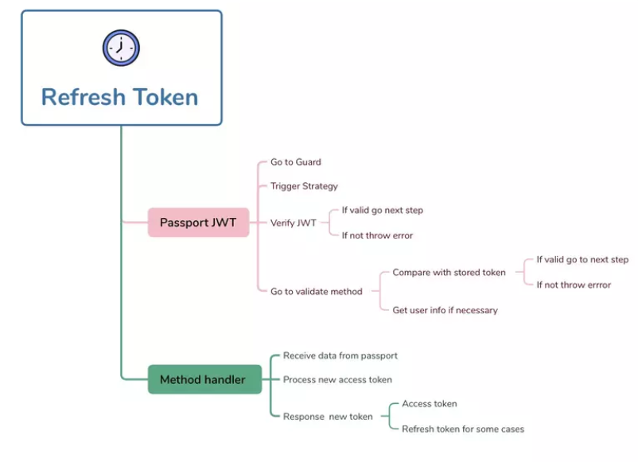
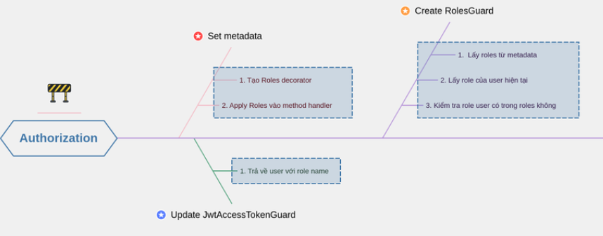

# Auth

## JWT

Cấu trúc JWT:

* Header: chứa loại token (typ) và thuật toán (alg) dùng để mã hóa (HMAC SHA256 - HS256 hoặc RSA).
* Payload: chứa các nội dung của thông tin (claims) và được chia làm 3 loại: reserved, public và private.
* Signature: được tạo ra bằng cách kết hợp Header, Payload và Secret key. JWT sẽ căn cứ vào phần này để verify xem token có hợp lệ hay không.

Cách JWT hoạt động: Quá trình xác thực tính hợp lệ trong JWT diễn ra như sau:

1. Đầu tiên sẽ tạo ra giá trị S1 = giá trị của Signature trong token.
2. Package JWT sẽ sign thông tin trong Header và Payload kết hợp với Secret key để ra giá trị Signature S2.
3. So sánh giữa S1 = S2, nếu bằng nhau thì token hợp lệ và ngược lại.

## Passportjs

Passport.js là một middleware xác thực user trong Node.js, cung cấp các chiến lược (strategy) xác thực khác nhau như OAuth, OpenID, Local Strategy, v.v. Việc sử dụng Passport.js giúp cho việc xác thực user trở nên dễ dàng và tiện lợi hơn nhờ vào các ưu điểm sau:

* Đơn giản hóa quá trình xác thực người dùng: Passport.js cung cấp cho các chiến lược xác thực phổ biến. Điều này giúp đơn giản hóa quá trình xác thực người dùng và không phải viết code xác thực lại từ đầu.

* Cải thiện tính bảo mật của ứng dụng: Passport.js được thiết kế để giảm thiểu các lỗ hổng bảo mật có thể xảy ra trong quá trình xác thực user. Nó sử dụng các chiến lược xác thực được chứng minh là an toàn và cung cấp các phương tiện để tùy chỉnh và cấu hình theo nhu cầu của ứng dụng.

* Hỗ trợ nhiều loại xác thực: Passport.js hỗ trợ nhiều loại xác thực khác nhau, bao gồm xác thực bằng local strategy, OAuth, OpenID, v.v. Điều này giúp cho ứng dụng của chúng ta trở nên linh hoạt và có thể tích hợp với nhiều dịch vụ xác thực khác nhau. Đó là những lý do tại sao mà theo mình chúng ta nên dùng Passport.js cho JWT. Trong dự án này quá trình xác thực của chúng ta sử dụng các strategy như sau:

* User gọi API đăng nhập để lấy access token. Passport-local sẽ thông qua auth service sẽ tiến hành validate thông tin đăng nhập và trả về token cho user.

* User gửi kèm access token khi gọi các API khác. Passport-jwt sẽ tiến hành validate access token và quyết định xem user có quyền truy cập hay không.

* User gửi refresh token khi gọi API để renew access token mới. Passport-jwt sẽ tiến hành validate refresh token và quyết định xem token có hợp lệ để renew không.

Nếu các bạn gặp lỗi "Unknown authentication strategy" thường là do 2 nguyên nhân:

* Strategy name ở guard và strategy không trùng khớp với nhau.
* Quên không để strategy vào provider.

Verify access token

API Refresh token

## Authorization

Phân quyền cũng là một phần không thể thiếu trong dự án của chúng ta, mình sẽ lấy ví dụ ở module user khi muốn xóa user thì bắt buộc phải là Admin

