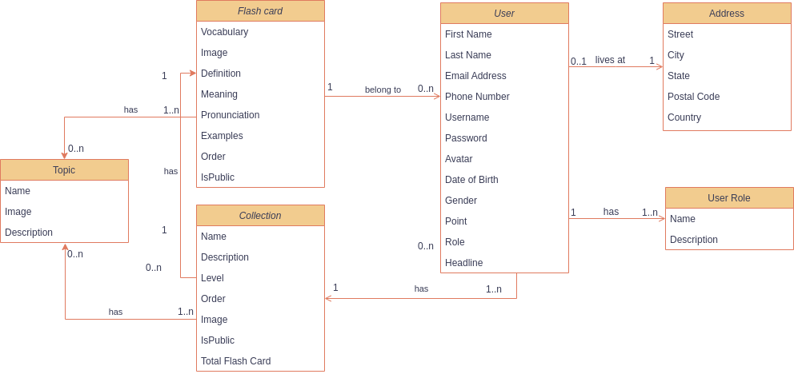
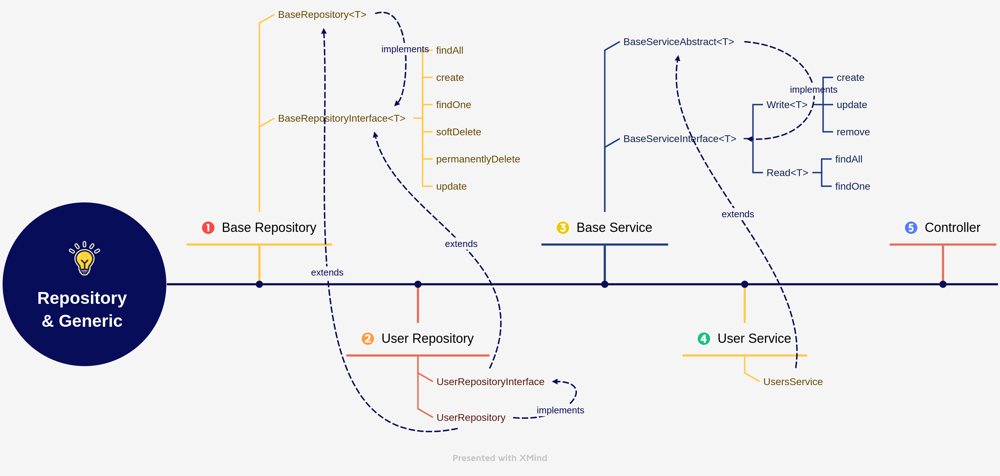

# Mongoose and generic type

## MongoDB

1. `Lưu trữ dữ liệu dưới dạng document`
2. `Mở rộng dễ dàng`
3. `Cung cấp các tính năng đa dạng`: indexing, replication, sharding, aggregation, và full-text search
4. `Sử dụng tài nguyên ít hơn so với cơ sở dữ liệu quan hệ`

Nếu đã sử dụng MongoDB thì không thể nào bỏ qua ODM phổ biến của nó là `Mongoose`.

* **Validation**: cung cấp tính năng validation cho các document trong cơ sở dữ liệu MongoDB, giúp đảm bảo rằng các dữ liệu được lưu trữ đúng định dạng và giá trị.
* **Schema**: cho phép định nghĩa các schema để định dạng dữ liệu, giúp đảm bảo rằng các tài liệu được lưu trữ theo cùng một định dạng và các trường bắt buộc.
* **Middleware**: cung cấp middleware để xử lý các sự kiện trong quá trình tương tác với cơ sở dữ liệu, giúp bạn tùy chỉnh hành vi của ứng dụng.
* **Query Building**: cung cấp một API query builder để tạo các truy vấn dữ liệu phức tạp, giúp đơn giản hóa việc tương tác với cơ sở dữ liệu.

## Database

* User đăng ký/ đăng nhập.
* User tạo và quản lí các Flash card.
* User tạo và quản lí các Collection, thêm Flash Card vào Collection.
* Flash Card và Collection có thể có một hoặc nhiều Topic

## Tạo các entity

5 module chính: User, User role, Topic, Flash card và Collection.

### Relationship

1. One to one
2. One to many
3. Many to many

### Mongoose Middleware

Một tính năng cũng khá hữu ích của Mongoose đó là Middleware ( hay còn gọi là pre và post hooks ).

Middleware: `document middleware`, `model middleware`, `aggregate middleware`, và `query middleware`.

### Virtual properties ( Optional )

Ví dụ trong trường hợp các bạn muốn user có cả thông tin first_name, last_name và full_name. Việc lưu first_name và last_name mà còn thêm full_name vào database sẽ gây ra dư thừa dữ liệu. Rất may là Mongoose có cung cấp cho chúng ta tính năng virtual properties.

## Repository Pattern Generic Service/Repository Pattern

Thông thường chúng ta học về Design Pattern đa phần là lý thuyết nên sẽ có phần khó hình dung và ghi nhớ. Vì thế trong phạm vi bài viết này mình muốn sử dụng Repository Pattern cho database layer kết hợp với Generic Pattern giúp tái sử dụng code để giúp các bạn phần nào hiểu được công dụng của nó trong dự án thực tế.

1. Giúp tách biệt phần xử lý database khỏi phần xử lý logic của ứng dụng. Việc này làm cho code trở nên rõ ràng và dễ hiểu hơn, và cũng giúp cho việc maintain code trở nên dễ dàng hơn.
2. Làm giảm sự phụ thuộc vào MongoDB hay bất kỳ hệ quản trị cơ sở dữ liệu nào khác. Chúng ta có thể thay đổi sang cái khác nếu thật sự cần
3. Giảm độ phức tạp của các lớp service. Bằng cách sử dụng các phương thức được định nghĩa trong repository, các lớp service có thể tập trung vào việc thực hiện logic chức năng thay vì phải xử lý các câu truy vấn dữ liệu phức tạp.
4. Cung cấp một cách thức để test database layer một cách độc lập. Chúng ta có thể tạo ra các đối tượng repository giả (mock repository) để test lớp service mà không cần kết nối đến cơ sở dữ liệu thật.

* **Repository layer**: chịu trách nhiệm gọi đến database để lấy và xử lý data.
* **Service layer**: nhận data từ controller và xử lý các logic mà không liên quan đến truy vấn database. Khi cần truy vấn database thì sẽ gọi đến để lấy dữ liệu từ repository layer.

Sau khi đã chia layer với Repository Pattern chúng ta sẽ ứng dụng Generic Repository Pattern tạo BaseRepositoryInterface và BaseRepository với nhiệm vụ chứa các method căn bản dùng chung cho các module để tránh code bị lặp lại.

BaseRepositoryInterface là interface mà chúng ta sẽ quy định các method mà một repository phải có. Chúng ta cần phải thiết kế các interface làm sao cho nội dung không thay đổi dù có thay đổi ORM hoặc hệ quản trị cơ sở dữ liệu.

BaseRepositoryAbstract là class implement các method từ BaseRepositoryInterface, logic query tùy theo loại database sẽ được triển khai ở đây. Sẽ bị thay đổi khi đổi ORM hoặc hệ quản trị cơ sở dữ liệu.

T extends BaseEntity: chỉ định T sẽ bao gồm các field trong BaseEntity. Nếu không extends thì IDE sẽ báo lỗi Property deleted_at does not exist on... khi chúng ta gọi item.deleted_at bên trong các method của BaseRepositoryAbstract.
