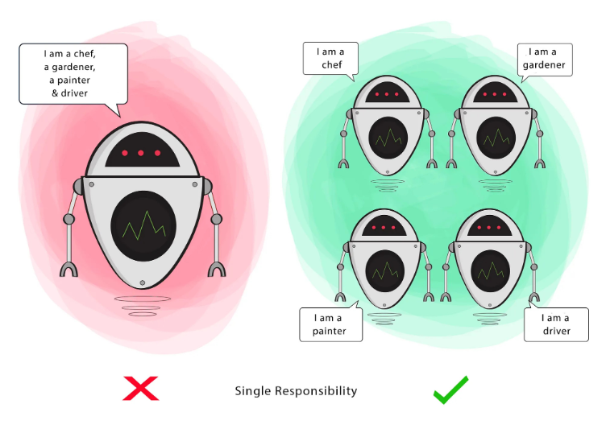
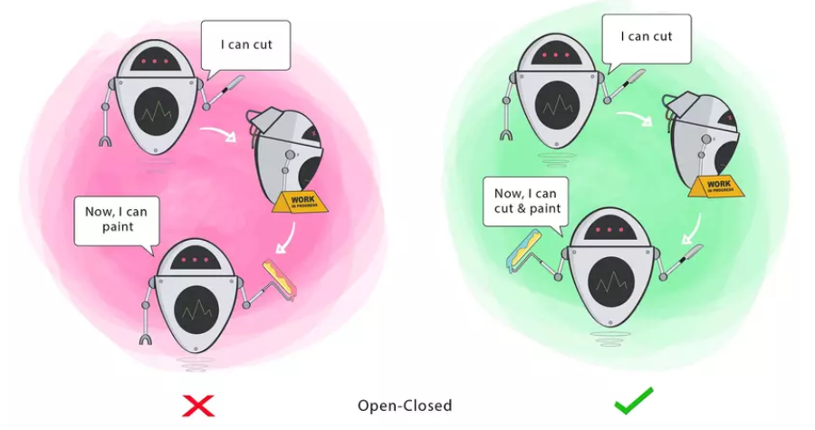
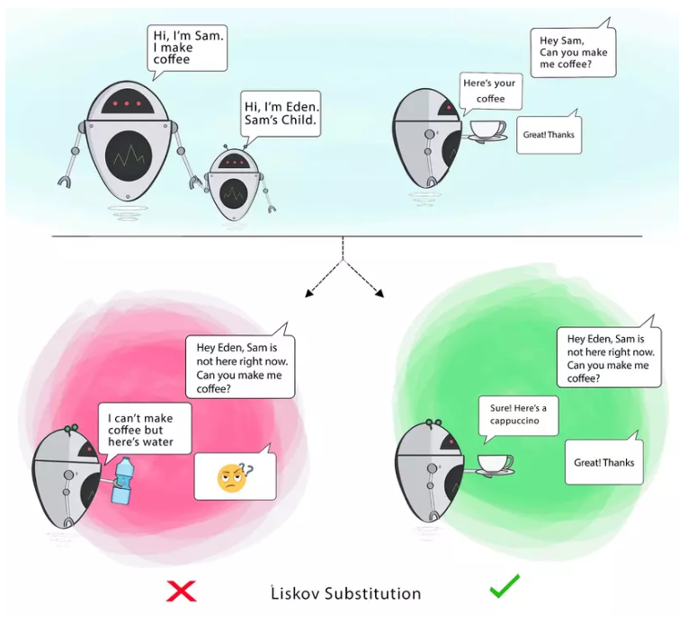
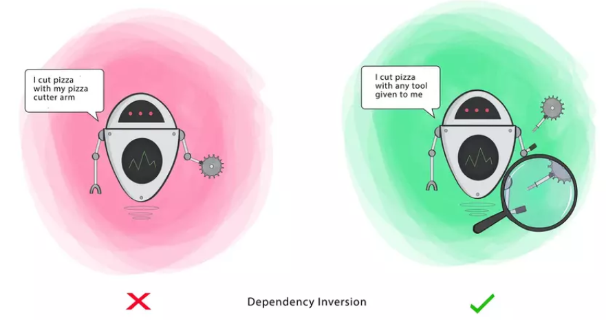

# S.O.L.I.D ✨️

## Single Responsability Principle - SRP

> Each class must have one, and only one, reason to change



```js
class Topic {
    createTopic(data: CreateTopicDto) {...}
    updateTopic(id: string, data: UpdateTopicDto) {...}
    deleteTopic(id: string) {...}
    getAllTopics(filter: GetAllFilter) {...}
    
    sendNotificationToSubscribers(id: string, content: string) {...} // Vi phạm SRP
    addNewSubscriber(id: string, user_id: string) {...} // Vi phạm SRP
}
```

Vi phạm nguyên tắc S vì nó đang làm các logic mặc dù vẫn nằm trong phạm vi Topic nhưng lại nằm ngoài trách nhiệm quản lý Topic của class.

Nhận ra một số vấn đề có thể xảy ra nếu chúng ta bỏ qua nguyên tắc **S**:

* Nếu viết toàn bộ chức năng liên quan vào một file thì số lượng dòng code trong file sẽ rất lớn.
* Khi cần chỉnh sửa logic chúng ta phải mất thời gian tìm kiếm trong file cả ngàn dòng để chỉnh sửa.
* Khó khăn trong việc tách các chức năng ra module riêng, ví dụ chúng ta muốn tách notification ra riêng để phục vụ cho các entity khác.
* Khi một chức năng bị lỗi có thể ảnh hưởng đến các chức năng khác không liên quan trong class.
* Làm cho việc viết test cũng trở nên phiền phức hơn. Thử nghĩ đến việc chúng ta phải mock hàng tá thứ cho một file test là đã thấy ngán rồi.

Giải pháp 💡

```js
class Topic {
    createTopic(data: CreateTopicDto) {...}
    updateTopic(id: string, data: UpdateTopicDto) {...}
    deleteTopic(id: string) {...}
    getAllTopics(filter: GetAllFilter) {...}
}

class Subscriber {
    addNewSubscriber(id: string, user_id: string) {...}
}

class Notifier {
    sendNotificationToSubscribers(id: string, content: string) {...}
}
```

Sau khi refactor lại chúng ta có thể thấy mỗi class đã đảm nhiệm một logic riêng:

* Topic: chịu trách nhiệm quản lí topic
* Subscriber: chịu trách nhiệm quản lí các subscriber
* Notifier: chịu trách nhiệm gửi thông báo

Mục tiêu hướng tới 🌅

> Giúp tách biệt các behaviors với nhau, để khi có lỗi phát sinh trong quá trình chỉnh sửa 1 behavior sẽ không ảnh hưởng các behavior không liên quan

## O: Open/Closed Principle - OCP

> Software entities (classes, modules, functions, and so on) should be open for extension but closed for modification



Vấn đề ⚠️

Chúng ta thường thấy nguyên lý này khi áp dụng các logic có nhiều điều kiện `if-else` hoặc `switch-case`.

Thoạt nhìn thì đoạn code trên không có vấn đề gì, và nếu như trong suốt vòng đời của ứng dụng chúng ta không thay đổi hoặc bổ sung thêm phương thức thanh toán thì nó hoàn toàn ổn 👌. Tuy nhiên với trường hợp chúng ta cần bổ sung thêm hoặc xóa bớt phương thức thanh toán và việc đó diễn ra thường xuyên thì nó mới phát sinh vấn đề 💣️

Mục tiêu hướng tới 🌅
> Tránh được các lỗi phát sinh không mong muốn khi chúng ta chỉnh sửa code có sẵn.

## L: Liskov Substitution Principle - LSP

> Any instance of a subclass or derived class should be substitutable for an instance of its base class without affecting the correctness of the program.

Biểu thị rằng các class con phải có khả năng thay thế được toàn bộ behavior của class mà nó kế thừa.



```js
export abstract class Vehicle {
  isEngineRunning = false;
  speed = 0;
  turnOnEngine(): void {
    this.isEngineRunning = true;
  }
  abstract accelerate(): void;
}
```

```js
export class Sedan extends Vehicle {
  accelerate(): void {
    this.speed += 80;
  }
}

export class Bicycle extends Vehicle {
  accelerate(): void {
    this.speed += 5;
  }
  turnOnEngine(): void {
    throw new Error("Bicycles don't have engines!");
  }
}

function goTravelling(vehicle: Vehicle) {
  vehicle.turnOnEngine();
  vehicle.accelerate();
  console.log(`Goingggg with speed ${vehicle.speed}`);
}

const sedan = new Sedan();
goTravelling(sedan) // ✅️ Chạy bình thường

const bicycle = new Bicycle();
goTravelling(bicycle) // ❌️ Báo lỗi: Bicycles don't have engines!
```

Giải pháp

```js
abstract class Vehicle {
  speed = 0;
  abstract accelerate(): void;
  // Loại bỏ method `turnOnEngine` khỏi class Vehicle
}

abstract class Car extends Vehicle{
  isEngineRunning = false;
}

export class Sedan extends Car {
  accelerate(): void {
    this.speed += 40;
  }
  turnOnEngine(): void {
    this.isEngineRunning = true;
  }
}

export class Bicycle extends Vehicle {
  accelerate(): void {
    this.speed += 5;
  }
}
```

Mục tiêu hướng tới 🌅

>Nguyên tắc này giúp đảm bảo tính nhất quán giữa class cha và các class kế thừa nó, đồng thời cũng giúp chúng ta có thể đoán trước được behavior của các class đó. Nếu chúng ta vi phạm nguyên tắc này có thể dẫn đến lỗi không mong muốn như ví dụ trên, quá trình maintain cũng trở nên khó khăn hơn.

## I: Interface Segregation Principle - ISP

> A class should not be forced to implement interfaces and methods that will not be used.

Mục tiêu hướng tới 🌅 Nguyên tắc này giúp code chúng ta trở nên flexible và modularity hơn bằng cách tách các action ra thành những interface riêng biệt. Bên cạnh đó code cũng trở nên readable từ đó dễ maintain hơn.

## D: Dependency Inversion Principle - DIP

> High-level modules should not depend on low-level modules. Both should depend on the abstraction.



```js
interface Topic {
  id: string;
  name: string;
  description: string;
}

class TopicRepository {
  constructor() {}
  create(topic: Topic) {}
}

class TopicService {
  private topicRepository: TopicRepository;

  constructor() {
    this.topicRepository = new TopicRepository();
  }

  create(topic: Topic) {
    this.topicRepository.create(topic);
  }
}
```

Rõ ràng từ ví dụ trên chúng ta thấy TopicService bị phụ thuộc và các method của TopicRepository, nếu chỉnh sửa tên method create thành save thì ngay lập tức TopicService sẽ bị lỗi. Bên cạnh đó việc test TopicService một cách độc lập cũng rất là khó do chúng ta phải tạo instance của TopicRepository và truyền vào TopicService 🤒.

Giải pháp 💡

```js
...
interface TopicRepositoryInterface {
    create(topic: Topic): Topic {}
}

class TopicRepository implements TopicRepositoryInterface {
  constructor() {}
  create(topic: Topic): topic {}
}

class TopicService {
  private topicRepository: TopicRepositoryInterface;

  constructor(repository: TopicRepositoryInterface) {
    this.topicRepository = repository
  }

  create(topic: Topic): Topic {
    return this.topicRepository.create(topic);
  }
}
```

DI allows the creation of dependent objects outside of a class and provides those objects to another class that depends on it through injection at runtime rather than the dependent class creating it. The benefit of this is that it creates a more modular and maintainable code.

IoC is a technique used for inverting the control flow of a program. Instead of the app controlling objects’ flow and creation, NestJS controls inversion. The NestJS IoC container manages the instantiation and injection of dependencies, where it creates a loosely coupled architecture by managing the dependencies between objects.

Mục tiêu hướng tới 🌅 Nguyên tắc này giúp code chúng ta loose coupling từ đó giúp tăng tính modularity, dễ test, bảo trì và mở rộng.
